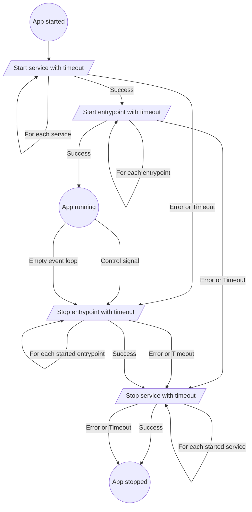

import Tabs from "@theme/Tabs";
import TabItem from "@theme/TabItem";

# Lifecycle

## Lifecycle

Application lifecycle managent is the main feature of Basica. The following flowchart represents how it works.



For a service or entrypoint to be considered part of the lifecycle, it has to be registered in `configureLifecycle()`.

### Startup

A startup item is a service that performs a one off operation, such as running database migrations or loading a ML model into memory.

<Tabs groupId="ts-style">
  <TabItem value="classes" label="Classes">
    ```ts title="service.ts"
    import { IStartup } from "@basica/core";

    export class MyService implements IStartup {

        async start(signal: AbortSignal) {
            // run migrations
        }
    }
    ```

  </TabItem>
  <TabItem value="objects" label="Object Factory">
    ```ts title="service.ts"
    import { IStartup } from "@basica/core";

    export const createMyService = () => ({
        start: async (signal: AbortSignal) => {
            // run migrations
        }
    }) satisfies IStartup;
    ```

  </TabItem>
</Tabs>

```ts title="index.ts"
// ...
const app = new AppBuilder(container)
    .configureLifecycle(b => b
        b.addStartup("my-service", () => container.myService)
    )
    .build();
// ...
```

### Shutdown

A shutdown item is a service that performs a cleanup of resources before shutdown, such as closing a database connection or stopping a server from accepting requests.

<Tabs groupId="ts-style">
  <TabItem value="classes" label="Classes">
    ```ts title="service.ts"
    import { IShutdown } from "@basica/core";

    export class MyService implements IShutdown {

        async shutdown(signal: AbortSignal) {
            // close db connection
        }
    }
    ```

  </TabItem>
  <TabItem value="objects" label="Object Factory">
    ```ts title="service.ts"
    import { IShutdown } from "@basica/core";

    export const createMyService = () => ({
        shutdown: async (signal: AbortSignal) => {
            // close db connection
        }
    }) satisfies IShutdown;
    ```

  </TabItem>
</Tabs>

```ts title="index.ts"
// ...
const app = new AppBuilder(container)
    .configureLifecycle(b => b
        b.addGracefulShutdown("my-service", () => container.myService)
    )
    .build();
// ...
```

### Entrypoint

An entrypoint is a service that performs both startup and shutdown operations, from which external external events interact with your application.
It should be used as the starting point for your business logic, such as a message broker subscriber or an api server.

<Tabs groupId="ts-style">
  <TabItem value="classes" label="Classes">
    ```ts title="service.ts"
    import { IEntrypoint } from "@basica/core";

    export class MyService implements IEntrypoint {

        async shutdown(signal: AbortSignal) {
            // listen for events from the msg broker
        }

        async shutdown(signal: AbortSignal) {
            // stop listening
        }
    }
    ```

  </TabItem>
  <TabItem value="objects" label="Object Factory">
    ```ts title="service.ts"
    import { IEntrypoint } from "@basica/core";

    export const createMyService = () => ({
        start: async (signal: AbortSignal) => {
            // listen for events from the msg broker
        }
        shutdown: async (signal: AbortSignal) => {
            // stop listening
        }
    }) satisfies IEntrypoint;
    ```

  </TabItem>
</Tabs>

```ts title="index.ts"
// ...
const app = new AppBuilder(container)
    .configureLifecycle(b => b
        b.addEntrypoint("my-service", () => container.myService)
    )
    .build();
// ...
```
